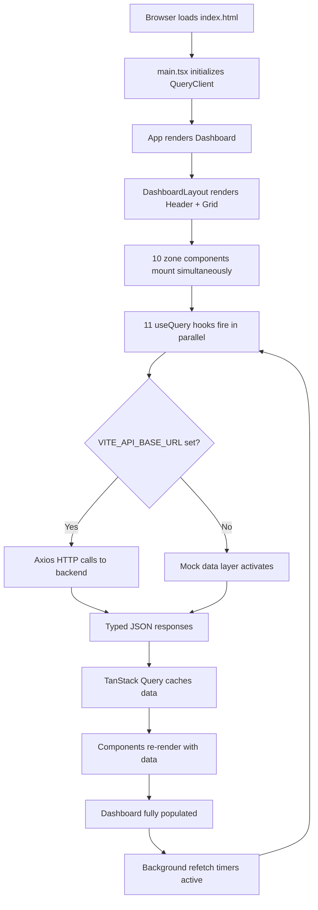
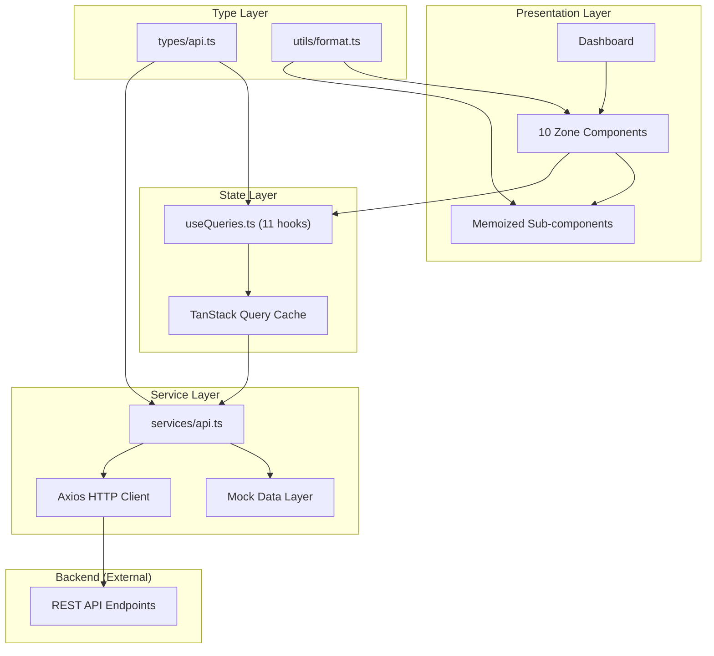

# REVIEW_PACKET.md

**Project:** SHAKTI Runtime Integration and Operational Command Center
**Owner:** Pratik Bhuwad
**Module:** Frontend Review Packet
**Version:** 1.0
**Last Updated:** 2025
**Classification:** Internal Technical Review

---

## 1. Project Summary

The SHAKTI Operational Command Center is a production-grade React frontend application that provides a centralized, real-time operational interface for monitoring the national power grid.

| Property | Value |
|---|---|
| Application Type | Single-Page Application (SPA) |
| Framework | React 19 + Vite 8 |
| Language | TypeScript 6 (strict, no `any`) |
| Styling | Tailwind CSS 4 (dark theme) |
| State Management | TanStack Query 5 (server state) |
| HTTP Client | Axios 1 |
| Charts | Recharts 3 (lazy-loaded) |
| Build Output | `dist/` — static files, no server required |
| Entry Point | `src/main.tsx` |
| Main Page | `src/pages/Dashboard.tsx` |

---

## 2. Entry Point and Startup Flow

```
index.html
  └── src/main.tsx
        ├── QueryClientProvider (TanStack Query)
        └── App
              └── Dashboard
                    └── DashboardLayout
                          ├── Header
                          └── CSS Grid (12-col)
                                ├── ExecutiveSummary      → /api/executive-metrics, /api/kpis
                                ├── NationalGridStatus    → /api/grid-status
                                ├── LiveAlertQueue        → /api/alerts
                                ├── RiskHeatmap           → /api/risk-scores
                                ├── ForecastPanel (lazy)  → /api/forecast
                                ├── IncidentQueue         → /api/incidents
                                ├── OperationalTimeline   → /api/timeline
                                ├── SystemHealth          → /api/system-health
                                ├── ReplayStatus          → /api/replay
                                └── EvidencePanel         → /api/evidence
```

On startup, all 11 API calls are made in parallel. The dashboard populates progressively as responses arrive. No zone blocks another.

---

## 3. Runtime Flow



---

## 4. API Dependencies

The frontend depends on 11 REST API endpoints. All are currently served by the mock data layer when `VITE_API_BASE_URL` is not configured.

| Endpoint | Zone | Interval | Status |
|---|---|---|---|
| `GET /api/executive-metrics` | Executive Summary | 30s | Mock active |
| `GET /api/kpis` | Executive Summary | 30s | Mock active |
| `GET /api/alerts` | Live Alert Queue | 15s | Mock active |
| `GET /api/grid-status` | National Grid Status | 30s | Mock active |
| `GET /api/risk-scores` | Risk Heatmap | 30s | Mock active |
| `GET /api/forecast` | Forecast Panel | 60s | Mock active |
| `GET /api/incidents` | Incident Queue | 30s | Mock active |
| `GET /api/timeline` | Operational Timeline | 15s | Mock active |
| `GET /api/system-health` | System Health | 20s | Mock active |
| `GET /api/replay` | Replay Status | 10s | Mock active |
| `GET /api/evidence` | Evidence Panel | 60s | Mock active |

To connect to a live backend: set `VITE_API_BASE_URL=https://your-api-server.example.com` in `.env` and rebuild.

---

## 5. Component Map

| Component | File | Data Source | Memoized |
|---|---|---|---|
| Header | `components/layout/Header.tsx` | `useState` (clock) | No |
| DashboardLayout | `layouts/DashboardLayout.tsx` | None | No |
| ExecutiveSummary | `components/dashboard/ExecutiveSummary.tsx` | `useExecutiveMetrics`, `useKPIs` | Partial |
| MetricCard | inside ExecutiveSummary | Props | Yes |
| KPICard | inside ExecutiveSummary | Props | Yes |
| NationalGridStatus | `components/dashboard/NationalGridStatus.tsx` | `useGridStatus` | Partial |
| RegionRow | inside NationalGridStatus | Props | Yes |
| LiveAlertQueue | `components/dashboard/LiveAlertQueue.tsx` | `useAlerts` | Partial |
| AlertRow | inside LiveAlertQueue | Props | Yes |
| RiskHeatmap | `components/dashboard/RiskHeatmap.tsx` | `useRiskScores` | Partial |
| RiskRow | inside RiskHeatmap | Props | Yes |
| ForecastPanel | `components/dashboard/ForecastPanel.tsx` | `useForecast` | Yes (whole component) |
| IncidentQueue | `components/dashboard/IncidentQueue.tsx` | `useIncidents` | Partial |
| IncidentRow | inside IncidentQueue | Props | Yes |
| OperationalTimeline | `components/dashboard/OperationalTimeline.tsx` | `useTimeline` | Partial |
| EventRow | inside OperationalTimeline | Props | Yes |
| SystemHealth | `components/dashboard/SystemHealth.tsx` | `useSystemHealth` | Partial |
| ServiceRow | inside SystemHealth | Props | Yes |
| ReplayStatus | `components/dashboard/ReplayStatus.tsx` | `useReplayJobs` | Partial |
| ReplayRow | inside ReplayStatus | Props | Yes |
| EvidencePanel | `components/dashboard/EvidencePanel.tsx` | `useEvidence` | Partial |
| EvidenceRow | inside EvidencePanel | Props | Yes |
| Skeleton | `components/ui/skeleton.tsx` | None | No |

---

## 6. Architecture Overview



---

## 7. Failure Behavior

The application is designed for graceful degradation:

| Failure | Behavior |
|---|---|
| Single API endpoint fails | Only the affected zone shows an error state with a Retry button. All other zones continue operating normally. |
| All API endpoints fail | All zones show independent error states. The header, layout, and navigation remain fully functional. |
| Network timeout (>10s) | Axios timeout triggers after 10 seconds. TanStack Query retries twice before entering error state. |
| Backend returns empty array | Zone renders an empty state message. No error is shown. |
| Lazy-loaded chunk fails | Forecast Panel shows the Suspense fallback (Skeleton). The rest of the dashboard is unaffected. |
| Background refetch fails | Previously cached data remains displayed. No error flash. Error state only appears after all retries are exhausted. |

---

## 8. Screenshots

> **Placeholder:** Insert production screenshots here before final review submission.

| Screenshot | Description |
|---|---|
| `screenshots/dashboard-full.png` | Full dashboard at 1440px — all zones populated |
| `screenshots/dashboard-loading.png` | Dashboard during initial load — skeleton states visible |
| `screenshots/dashboard-error.png` | Dashboard with one zone in error state |
| `screenshots/dashboard-tablet.png` | Dashboard at 768px tablet breakpoint |
| `screenshots/dashboard-mobile.png` | Dashboard at 375px mobile breakpoint |
| `screenshots/executive-summary.png` | Executive Summary zone — metrics and KPIs |
| `screenshots/alert-queue.png` | Live Alert Queue — severity-coded alerts |
| `screenshots/forecast-chart.png` | Forecast Panel — area chart with tooltip |
| `screenshots/incident-queue.png` | Incident Queue — active incidents |
| `screenshots/evidence-panel.png` | Evidence Panel — confidence bars |

---

## 9. Walkthrough Video

> **Placeholder:** Insert walkthrough video link here before final review submission.

| Item | Details |
|---|---|
| Video Title | SHAKTI Operational Command Center — Frontend Walkthrough |
| Duration | ~5 minutes |
| Coverage | Dashboard load, zone interactions, responsive behavior, error state demonstration |
| Format | MP4 / Loom / YouTube (unlisted) |
| Link | `[INSERT LINK]` |

---

## 10. Evidence Checklist

### Code Quality

- [x] TypeScript strict mode — zero `any` types
- [x] All API response types defined in `src/types/api.ts`
- [x] All components have typed props
- [x] No prop drilling — all data fetched via hooks
- [x] `React.memo()` applied to all list-row sub-components
- [x] `React.lazy()` applied to Recharts-dependent component
- [x] Zero TypeScript compilation errors (`npx tsc --noEmit` passes)
- [x] Production build succeeds (`npm run build` passes)

### UI Requirements

- [x] Dark theme throughout (`slate-950` base)
- [x] Loading skeleton states on all zones
- [x] Error states with retry buttons on all zones
- [x] Empty states on list zones
- [x] Responsive layout (mobile, tablet, desktop)
- [x] ARIA labels on all zone sections
- [x] Status indicators use color + text (not color alone)
- [x] Live clock in header
- [x] LIVE pulse indicator

### Architecture Requirements

- [x] CSS Grid layout (12-column)
- [x] TanStack Query for all server state
- [x] Axios HTTP client with 10s timeout
- [x] Mock API layer with production-contract-compatible data
- [x] Environment variable for API base URL
- [x] Parallel API calls on startup
- [x] Per-zone independent error handling
- [x] Background polling with configurable intervals
- [x] Code splitting (ForecastPanel lazy-loaded)

### Documentation

- [x] `dashboard_architecture.md` — complete with Mermaid diagrams
- [x] `dashboard_zoning.md` — complete with grid specs
- [x] `component_inventory.md` — complete with props and state
- [x] `README.md` — complete with installation and scripts
- [x] `UI_ARCHITECTURE.md` — complete with theme and layout strategy
- [x] `COMPONENT_LIBRARY.md` — complete with usage examples
- [x] `RUNTIME_INTEGRATION.md` — complete with sequence diagrams
- [x] `TESTING_GUIDE.md` — complete with manual checklist
- [x] `REVIEW_PACKET.md` — this document

---

## 11. Known Limitations

| Limitation | Description | Planned Resolution |
|---|---|---|
| No WebSocket support | All data is polled via HTTP. Real-time push updates are not implemented. | Replace `refetchInterval` with WebSocket subscription in hooks |
| No GIS map | Grid status and risk heatmap use bar charts, not geographic maps | Integrate Leaflet or Mapbox in a future iteration |
| No authentication | No login, session management, or role-based access control | Implement auth layer with JWT or OAuth2 |
| No light mode | Application is dark-theme only | Add CSS variable theme switching |
| No filtering | Alert queue, incident queue, and timeline have no filter or search | Add filter controls to list zones |
| Single page | No multi-page routing implemented | Add React Router routes for detail pages |
| No WebSocket | Polling only — not suitable for sub-second update requirements | Implement WebSocket or SSE for high-frequency data |

---

## 12. Future Improvements

| Priority | Improvement | Effort |
|---|---|---|
| High | WebSocket integration for real-time alerts and grid status | Medium |
| High | Authentication and role-based dashboard visibility | High |
| Medium | Interactive GIS map for grid status and risk heatmap | High |
| Medium | Alert acknowledgement action (POST /api/alerts/:id/acknowledge) | Low |
| Medium | Incident detail page with full timeline and evidence | Medium |
| Medium | Filter and search on alert queue, incident queue, timeline | Medium |
| Low | Light/dark theme toggle | Low |
| Low | User preferences persistence (localStorage) | Low |
| Low | Drag-and-drop dashboard zone reordering | High |
| Low | Export to PDF / CSV for evidence and incident reports | Medium |
