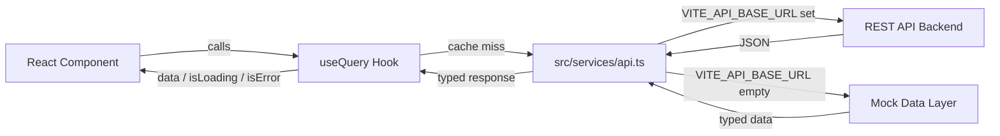
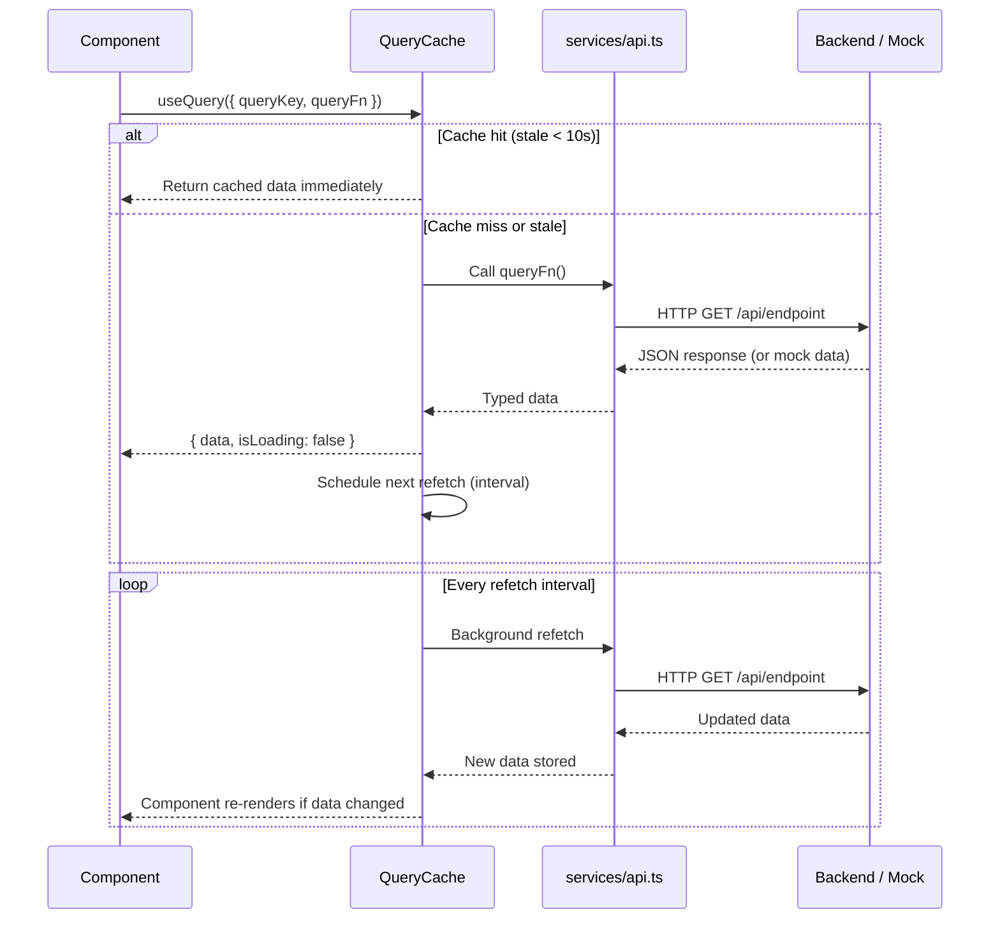
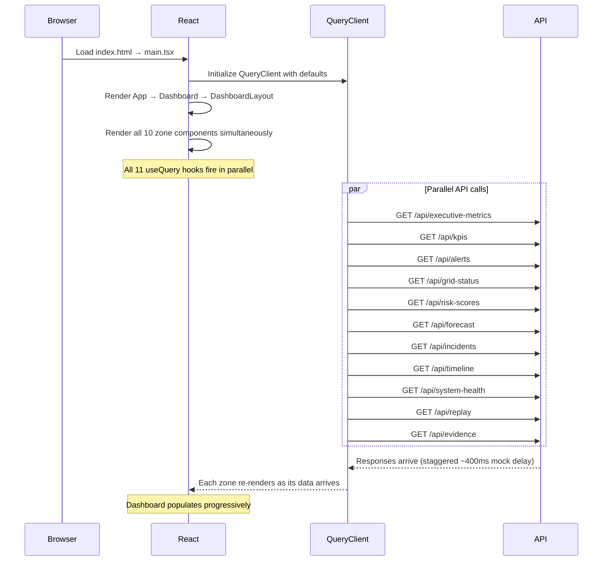

# RUNTIME_INTEGRATION.md

**Project:** SHAKTI Runtime Integration and Operational Command Center
**Owner:** Pratik Bhuwad
**Module:** Runtime Integration
**Version:** 1.0
**Last Updated:** 2025

---

## 1. Runtime Architecture

The SHAKTI frontend is a **pure consumer** of backend runtime APIs. It contains no business logic, no data transformation beyond display formatting, and no operational decision-making.

The integration layer consists of three files:

| File | Responsibility |
|---|---|
| `src/types/api.ts` | TypeScript interfaces for all API response contracts |
| `src/services/api.ts` | Axios HTTP client + mock data layer |
| `src/hooks/useQueries.ts` | TanStack Query hooks that expose data to components |



---

## 2. API Endpoint Contracts

All endpoints follow REST conventions. The frontend expects JSON responses matching the TypeScript interfaces defined in `src/types/api.ts`.

| Endpoint | Method | Response Type | Hook | Refetch |
|---|---|---|---|---|
| `/api/executive-metrics` | GET | `ExecutiveMetric[]` | `useExecutiveMetrics` | 30s |
| `/api/kpis` | GET | `KPI[]` | `useKPIs` | 30s |
| `/api/alerts` | GET | `Alert[]` | `useAlerts` | 15s |
| `/api/grid-status` | GET | `GridStatus` | `useGridStatus` | 30s |
| `/api/risk-scores` | GET | `RiskScore[]` | `useRiskScores` | 30s |
| `/api/forecast` | GET | `Forecast` | `useForecast` | 60s |
| `/api/incidents` | GET | `Incident[]` | `useIncidents` | 30s |
| `/api/timeline` | GET | `TimelineEvent[]` | `useTimeline` | 15s |
| `/api/system-health` | GET | `SystemHealth` | `useSystemHealth` | 20s |
| `/api/replay` | GET | `ReplayJob[]` | `useReplayJobs` | 10s |
| `/api/evidence` | GET | `Evidence[]` | `useEvidence` | 60s |

---

## 3. TypeScript API Contracts

All interfaces are defined in `src/types/api.ts`. These are the contracts the backend must satisfy.

### Primitive Types

```typescript
type Severity = "critical" | "high" | "medium" | "low" | "info";
type OperationalStatus = "online" | "offline" | "warning" | "degraded";
type IncidentStatus = "open" | "investigating" | "resolved" | "closed";
type ReplayState = "idle" | "running" | "paused" | "completed" | "failed";
type TrendDirection = "up" | "down" | "stable";
```

### Key Response Interfaces

```typescript
interface ExecutiveMetric {
  id: string;
  title: string;
  value: string | number;
  unit?: string;
  trend: TrendDirection;
  trendValue: string;
  status: OperationalStatus;
  icon: string; // Lucide icon name
}

interface Alert {
  id: string;
  severity: Severity;
  message: string;
  timestamp: string; // ISO 8601
  source: string;
  region: string;
  acknowledged: boolean;
}

interface GridStatus {
  overallStatus: OperationalStatus;
  totalLoad: number;    // GW
  totalCapacity: number; // GW
  frequency: number;    // Hz
  regions: GridRegion[];
  lastUpdated: string;  // ISO 8601
}

interface Incident {
  id: string;
  severity: Severity;
  title: string;
  location: string;
  region: string;
  status: IncidentStatus;
  assignedOperator: string;
  createdAt: string;   // ISO 8601
  updatedAt: string;   // ISO 8601
}

interface Forecast {
  horizon: string;     // e.g. "24h"
  confidence: number;  // 0–100
  points: ForecastPoint[];
  peakDemand: number;  // GW
  peakTime: string;    // ISO 8601
}

interface Evidence {
  id: string;
  source: string;
  confidence: number;  // 0–100
  timestamp: string;   // ISO 8601
  description: string;
  relatedIncidentId?: string;
  type: "sensor" | "log" | "operator" | "model" | "external";
}
```

---

## 4. Axios Client Configuration

```typescript
// src/services/api.ts
const api = axios.create({
  baseURL: import.meta.env.VITE_API_BASE_URL ?? "",
  timeout: 10000,
  headers: { "Content-Type": "application/json" },
});
```

- **Timeout:** 10 seconds. Requests that exceed this are treated as failures.
- **Base URL:** Injected at build time via `VITE_API_BASE_URL` environment variable.
- **Headers:** `Content-Type: application/json` on all requests.

---

## 5. Mock API Strategy

The mock data layer is activated automatically when `VITE_API_BASE_URL` is not set:

```typescript
export async function fetchAlerts(): Promise<Alert[]> {
  if (BASE_URL) {
    const { data } = await api.get<Alert[]>("/api/alerts");
    return data;
  }
  return mockGet([/* production-contract-compatible mock data */]);
}
```

### Mock Data Principles

- All mock data satisfies the exact same TypeScript interfaces as the live API.
- Timestamps are generated dynamically relative to `Date.now()` — mock data is always "recent".
- A simulated 400ms network delay (`await delay(400)`) is applied to all mock responses to exercise loading states during development.
- Switching to a live backend requires only setting `VITE_API_BASE_URL` — no code changes.

---

## 6. TanStack Query Configuration

### Global Defaults

```typescript
// src/main.tsx
const queryClient = new QueryClient({
  defaultOptions: {
    queries: {
      staleTime: 10_000,           // Data fresh for 10s — no refetch within window
      retry: 2,                    // Retry failed requests twice before error state
      refetchOnWindowFocus: false, // No automatic refetch on tab focus
    },
  },
});
```

### Per-Hook Refetch Intervals

```typescript
// src/hooks/useQueries.ts
export const useAlerts = () =>
  useQuery({ queryKey: ["alerts"], queryFn: fetchAlerts, refetchInterval: 15_000 });

export const useReplayJobs = () =>
  useQuery({ queryKey: ["replay"], queryFn: fetchReplayJobs, refetchInterval: 10_000 });
```

Refetch intervals are set per-hook based on data volatility, not globally.

---

## 7. Data Flow



---

## 8. Error Handling

### Network / HTTP Errors

TanStack Query catches all errors thrown by the fetch function. After 2 retries (global default), the query enters `isError: true` state.

Each zone component renders an independent error state:

```tsx
{isError && (
  <div className="flex flex-col items-center justify-center py-6 gap-2">
    <p className="text-xs text-red-400">Failed to load [zone]</p>
    <button onClick={() => refetch()} className="text-xs text-slate-400 hover:text-slate-200 underline">
      Retry
    </button>
  </div>
)}
```

### Zone Independence

A failure in one zone does not affect any other zone. Each zone has its own query key, its own error state, and its own retry button. The dashboard remains fully operational with partial data.

### Retry Behavior

| Scenario | Behavior |
|---|---|
| First failure | TanStack Query retries automatically (attempt 1 of 2) |
| Second failure | TanStack Query retries automatically (attempt 2 of 2) |
| Third failure | `isError: true` — error state rendered |
| User clicks Retry | `refetch()` called — query re-executes immediately |
| Background refetch fails | Previous cached data remains displayed — no error flash |

---

## 9. Loading States

Every zone renders skeleton placeholders during the initial data fetch (`isLoading: true`). Background refetches (`isFetching: true` but `isLoading: false`) do not show skeletons — the existing data remains visible.

| State | `isLoading` | `isFetching` | `isError` | Rendered |
|---|---|---|---|---|
| Initial load | true | true | false | Skeleton placeholders |
| Data loaded | false | false | false | Data |
| Background refetch | false | true | false | Data (no skeleton) |
| Error (after retries) | false | false | true | Error state + retry |
| Retry in progress | false | true | false | Data (if cached) or skeleton |

---

## 10. Caching Strategy

| Property | Value | Effect |
|---|---|---|
| `staleTime` | 10,000ms | Data is considered fresh for 10s — no duplicate requests within this window |
| `gcTime` (default) | 300,000ms | Unused cache entries are garbage collected after 5 minutes |
| `refetchOnWindowFocus` | false | No automatic refetch when user returns to the tab |
| `refetchInterval` | Per-hook (10s–60s) | Background polling keeps data current |

Background refetches are transparent to the user — they do not trigger loading states or visual disruption.

---

## 11. Integration Sequence — Full Startup



All 11 API calls are made in parallel on initial load. Zones populate as their individual responses arrive, providing a progressive loading experience rather than a single blocking load.
