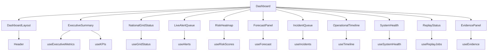

# component_inventory.md

**Project:** SHAKTI Runtime Integration and Operational Command Center
**Owner:** Pratik Bhuwad
**Module:** Component Inventory
**Version:** 2.0
**Last Updated:** 2025

---

## 1. Purpose

This document is the authoritative inventory of all React components in the SHAKTI Operational Command Center. It defines each component's responsibility, props, data source, state behavior, dependencies, and folder location — as implemented in the production codebase.

---

## 2. Folder Organization

```
src/
├── components/
│   ├── dashboard/
│   │   ├── ExecutiveSummary.tsx
│   │   ├── NationalGridStatus.tsx
│   │   ├── LiveAlertQueue.tsx
│   │   ├── RiskHeatmap.tsx
│   │   ├── ForecastPanel.tsx
│   │   ├── IncidentQueue.tsx
│   │   ├── OperationalTimeline.tsx
│   │   ├── SystemHealth.tsx
│   │   ├── ReplayStatus.tsx
│   │   └── EvidencePanel.tsx
│   ├── layout/
│   │   └── Header.tsx
│   └── ui/
│       └── skeleton.tsx
├── layouts/
│   └── DashboardLayout.tsx
├── pages/
│   └── Dashboard.tsx
├── hooks/
│   └── useQueries.ts
├── services/
│   └── api.ts
├── types/
│   └── api.ts
├── utils/
│   └── format.ts
└── lib/
    └── utils.ts
```

---

## 3. Component Relationships



---

## 4. Layout Components

### 4.1 DashboardLayout

| Property | Value |
|---|---|
| File | `src/layouts/DashboardLayout.tsx` |
| Purpose | Root layout wrapper providing dark background and flex column structure |
| Props | `children: ReactNode` |
| State | None |
| Dependencies | `Header` |

Renders `min-h-screen bg-slate-950 flex flex-col`. The `<main>` element is `flex-1 overflow-auto p-3`, allowing the grid to scroll if content exceeds viewport.

---

### 4.2 Header

| Property | Value |
|---|---|
| File | `src/components/layout/Header.tsx` |
| Purpose | Application top bar with branding, live clock, LIVE indicator, notifications, user identity |
| Props | None |
| State | `time: Date` — updated every 1 second via `setInterval` |
| Dependencies | `lucide-react` (Bell, Activity, Zap) |

The live clock uses a `useEffect` with `setInterval(1000)` and cleans up on unmount. The LIVE indicator uses a `bg-emerald-400 animate-pulse` dot.

---

### 4.3 Dashboard (Page)

| Property | Value |
|---|---|
| File | `src/pages/Dashboard.tsx` |
| Purpose | Root page component. Composes the 12-column CSS Grid and places all zone components. |
| Props | None |
| State | None (all state is in child components via hooks) |
| Dependencies | All 10 dashboard zone components, `DashboardLayout`, `Skeleton` |

`ForecastPanel` is lazy-loaded via `React.lazy()` and wrapped in `<Suspense>` with a `Skeleton` fallback.

---

## 5. Dashboard Zone Components

### 5.1 ExecutiveSummary

| Property | Value |
|---|---|
| File | `src/components/dashboard/ExecutiveSummary.tsx` |
| Purpose | Renders 4 executive metric cards and 4 KPI cards in two responsive rows |
| Props | None (data fetched internally) |
| Hooks | `useExecutiveMetrics()`, `useKPIs()` |
| API Endpoints | `GET /api/executive-metrics`, `GET /api/kpis` |
| Refetch | 30s |
| Loading State | 8× `Skeleton` placeholders |
| Error State | Inline per-hook (metrics and KPIs fail independently) |
| Sub-components | `MetricCard` (memo), `KPICard` (memo), `TrendBadge` |

**MetricCard props:**
```typescript
{ metric: ExecutiveMetric }
// ExecutiveMetric: { id, title, value, unit?, trend, trendValue, status, icon }
```

**KPICard props:**
```typescript
{ kpi: KPI }
// KPI: { id, title, value, unit, trend, trendValue, previousValue }
```

---

### 5.2 NationalGridStatus

| Property | Value |
|---|---|
| File | `src/components/dashboard/NationalGridStatus.tsx` |
| Purpose | Displays national grid overview: total load, frequency, overall status, and per-region load bars |
| Props | None |
| Hooks | `useGridStatus()` |
| API Endpoint | `GET /api/grid-status` |
| Refetch | 30s |
| Loading State | 5× `Skeleton` rows |
| Error State | Inline error + retry button |
| Sub-components | `RegionRow` (memo) |

**RegionRow props:**
```typescript
{ region: GridRegion }
// GridRegion: { id, name, status, load, capacity, frequency }
```

Load percentage bar color: green `<75%`, yellow `75–90%`, red `>90%`.

---

### 5.3 LiveAlertQueue

| Property | Value |
|---|---|
| File | `src/components/dashboard/LiveAlertQueue.tsx` |
| Purpose | Displays real-time operational alerts with severity coding and acknowledgement state |
| Props | None |
| Hooks | `useAlerts()` |
| API Endpoint | `GET /api/alerts` |
| Refetch | 15s |
| Loading State | 4× `Skeleton` rows |
| Error State | Inline error + retry button |
| Empty State | "No active alerts" message |
| Sub-components | `AlertRow` (memo) |

**AlertRow props:**
```typescript
{ alert: Alert }
// Alert: { id, severity, message, timestamp, source, region, acknowledged }
```

Acknowledged alerts are rendered at 50% opacity with a `CheckCircle` icon.

---

### 5.4 RiskHeatmap

| Property | Value |
|---|---|
| File | `src/components/dashboard/RiskHeatmap.tsx` |
| Purpose | Visualizes per-region risk scores as horizontal progress bars, sorted by score descending |
| Props | None |
| Hooks | `useRiskScores()` |
| API Endpoint | `GET /api/risk-scores` |
| Refetch | 30s |
| Loading State | 5× `Skeleton` rows |
| Error State | Inline error + retry button |
| Sub-components | `RiskRow` (memo) |

**RiskRow props:**
```typescript
{ risk: RiskScore }
// RiskScore: { regionId, regionName, riskLevel, score, factors }
```

Bar colors: `critical` → red, `high` → orange, `medium` → yellow, `low` → emerald.

---

### 5.5 ForecastPanel

| Property | Value |
|---|---|
| File | `src/components/dashboard/ForecastPanel.tsx` |
| Purpose | Renders a 24-hour demand and renewable generation area chart with peak demand summary |
| Props | None |
| Hooks | `useForecast()` |
| API Endpoint | `GET /api/forecast` |
| Refetch | 60s |
| Loading State | Single `Skeleton` block (h-36) |
| Error State | Inline error + retry button |
| Bundle | Lazy-loaded — Recharts is excluded from main bundle |
| Sub-components | `CustomTooltip` (inline), Recharts `AreaChart`, `Area`, `XAxis`, `YAxis` |

Chart series: `Demand` (indigo), `Renewable` (emerald). Both use gradient fills.

---

### 5.6 IncidentQueue

| Property | Value |
|---|---|
| File | `src/components/dashboard/IncidentQueue.tsx` |
| Purpose | Displays active operational incidents with severity borders, status, location, and operator |
| Props | None |
| Hooks | `useIncidents()` |
| API Endpoint | `GET /api/incidents` |
| Refetch | 30s |
| Loading State | 4× `Skeleton` rows |
| Error State | Inline error + retry button |
| Empty State | "No active incidents" message |
| Sub-components | `IncidentRow` (memo) |

**IncidentRow props:**
```typescript
{ incident: Incident }
// Incident: { id, severity, title, location, region, status, assignedOperator, createdAt, updatedAt }
```

---

### 5.7 OperationalTimeline

| Property | Value |
|---|---|
| File | `src/components/dashboard/OperationalTimeline.tsx` |
| Purpose | Chronological feed of operational events categorized by type with icons |
| Props | None |
| Hooks | `useTimeline()` |
| API Endpoint | `GET /api/timeline` |
| Refetch | 15s |
| Loading State | 5× `Skeleton` rows |
| Error State | Inline error + retry button |
| Sub-components | `EventRow` (memo) |

**EventRow props:**
```typescript
{ event: TimelineEvent }
// TimelineEvent: { id, timestamp, event, source, category, severity? }
```

Category icons: `system` → Cpu, `operator` → User, `alert` → AlertCircle, `incident` → FileText.

---

### 5.8 SystemHealth

| Property | Value |
|---|---|
| File | `src/components/dashboard/SystemHealth.tsx` |
| Purpose | Displays per-service latency, uptime, and status with an overall health score bar |
| Props | None |
| Hooks | `useSystemHealth()` |
| API Endpoint | `GET /api/system-health` |
| Refetch | 20s |
| Loading State | 6× `Skeleton` rows |
| Error State | Inline error + retry button |
| Sub-components | `ServiceRow` (memo) |

**ServiceRow props:**
```typescript
{ svc: ServiceHealth }
// ServiceHealth: { name, status, latency, uptime, lastChecked }
```

---

### 5.9 ReplayStatus

| Property | Value |
|---|---|
| File | `src/components/dashboard/ReplayStatus.tsx` |
| Purpose | Displays replay job progress, event counts, state, and duration |
| Props | None |
| Hooks | `useReplayJobs()` |
| API Endpoint | `GET /api/replay` |
| Refetch | 10s |
| Loading State | 2× `Skeleton` blocks |
| Error State | Inline error + retry button |
| Empty State | "No replay jobs" message |
| Sub-components | `ReplayRow` (memo) |

**ReplayRow props:**
```typescript
{ job: ReplayJob }
// ReplayJob: { id, name, progress, duration, state, startTime, estimatedEnd, eventsProcessed, totalEvents }
```

---

### 5.10 EvidencePanel

| Property | Value |
|---|---|
| File | `src/components/dashboard/EvidencePanel.tsx` |
| Purpose | Displays evidence records with confidence bars, type icons, and related incident links |
| Props | None |
| Hooks | `useEvidence()` |
| API Endpoint | `GET /api/evidence` |
| Refetch | 60s |
| Loading State | 4× `Skeleton` blocks in 2-column grid |
| Error State | Inline error + retry button |
| Sub-components | `EvidenceRow` (memo), `ConfidenceBar` |

**EvidenceRow props:**
```typescript
{ ev: Evidence }
// Evidence: { id, source, confidence, timestamp, description, relatedIncidentId?, type }
```

Evidence type icons: `sensor` → Cpu, `log` → FileText, `operator` → User, `model` → BarChart2, `external` → Globe.

---

## 6. Shared UI Components

### 6.1 Skeleton

| Property | Value |
|---|---|
| File | `src/components/ui/skeleton.tsx` |
| Purpose | Animated loading placeholder |
| Props | `className?: string` + all `div` HTML attributes |
| Base class | `animate-pulse rounded-md bg-slate-700/50` |

---

## 7. Utility Modules

### 7.1 src/utils/format.ts

| Function | Signature | Purpose |
|---|---|---|
| `formatRelativeTime` | `(iso: string) => string` | Converts ISO timestamp to "2m ago", "3h ago", etc. |
| `formatTime` | `(iso: string) => string` | Formats ISO to HH:MM (en-IN locale) |
| `severityColor` | `(severity: Severity) => string` | Returns Tailwind text color class for severity |
| `severityBg` | `(severity: Severity) => string` | Returns Tailwind bg+border class for severity |
| `statusColor` | `(status: OperationalStatus) => string` | Returns Tailwind text color for operational status |
| `statusDot` | `(status: OperationalStatus) => string` | Returns Tailwind bg color for status dot |
| `trendIcon` | `(trend: TrendDirection) => string` | Returns ↑, ↓, or → |
| `trendColor` | `(trend: TrendDirection, inverse?: boolean) => string` | Returns green/red/slate for trend direction |
| `clamp` | `(value, min, max) => number` | Numeric clamp utility |

### 7.2 src/lib/utils.ts

| Function | Signature | Purpose |
|---|---|---|
| `cn` | `(...inputs: ClassValue[]) => string` | Merges Tailwind classes using clsx + tailwind-merge |

---

## 8. Reusability Guidelines

- Every list-row sub-component is wrapped in `React.memo()` to prevent re-renders when parent refetches.
- No dashboard zone component accepts props — all data is fetched via hooks internally.
- Utility functions in `src/utils/format.ts` are pure functions with no side effects and can be used in any component.
- The `Skeleton` component accepts any `className` override for flexible sizing.
- All color decisions are centralized in `format.ts` — changing a severity color requires editing one function.
