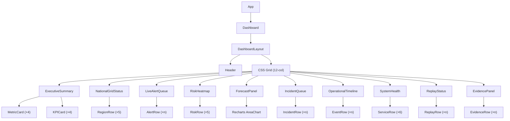
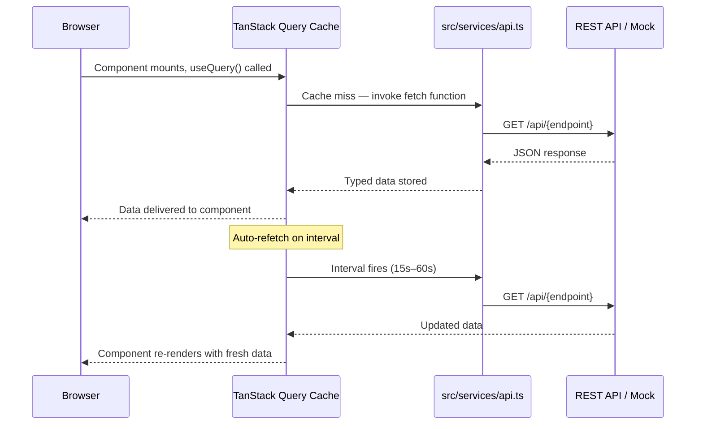

# dashboard_architecture.md

**Project:** SHAKTI Runtime Integration and Operational Command Center
**Owner:** Pratik Bhuwad
**Module:** Frontend Dashboard Architecture
**Version:** 2.0
**Last Updated:** 2025

---

## 1. Purpose

The SHAKTI Operational Command Center is a production-grade frontend application that provides a centralized, real-time operational interface for monitoring the national power grid. It consolidates runtime intelligence, live alerts, forecasting insights, incident tracking, system health, replay status, and operational evidence into a single command-grade interface.

The dashboard is designed to replace static reporting with a responsive, information-dense operational command center that enables grid operators, regional controllers, and executive users to achieve situational awareness within five seconds of loading.

---

## 2. Architecture Overview

The frontend is a single-page application (SPA) built on React 19 with Vite 8 as the build toolchain. It follows a strict separation between presentation, data-fetching, and type contracts.

```
┌─────────────────────────────────────────────────────────────┐
│                     Browser (SPA)                           │
│                                                             │
│  ┌──────────────┐   ┌──────────────┐   ┌────────────────┐  │
│  │  React UI    │   │ TanStack     │   │  Axios HTTP    │  │
│  │  Components  │◄──│  Query Cache │◄──│  Client        │  │
│  └──────────────┘   └──────────────┘   └────────────────┘  │
│                                                │            │
└────────────────────────────────────────────────┼────────────┘
                                                 │
                                    ┌────────────▼────────────┐
                                    │   REST API Backend      │
                                    │   (VITE_API_BASE_URL)   │
                                    └─────────────────────────┘
```

When `VITE_API_BASE_URL` is not set, the service layer activates production-contract-compatible mock data, enabling fully functional development without a live backend.

---

## 3. Dashboard Philosophy

The dashboard is designed as an **operational command center**, not a reporting tool. Three principles govern every design decision:

| Principle | Description |
|---|---|
| Operational First | Critical alerts, grid status, and executive metrics occupy the highest visual priority. Analytical data follows. |
| Low Scroll | All Level 1 information is visible within the initial viewport on a 1440px display. |
| Runtime Driven | The frontend contains zero business logic. It consumes and visualizes API outputs only. |

---

## 4. Information Hierarchy

Information is organized into three operational levels, rendered top-to-bottom on the dashboard.

| Level | Name | Zones | Purpose |
|---|---|---|---|
| 1 | Immediate Awareness | Executive Summary, Grid Status, Live Alerts | Answer: "Is the system normal?" |
| 2 | Operational Analysis | Risk Heatmap, Forecast, Incident Queue | Answer: "What has changed and why?" |
| 3 | Investigation & Evidence | Timeline, System Health, Replay, Evidence | Answer: "What happened and what supports it?" |

---

## 5. Component Hierarchy



---

## 6. Runtime Data Flow



---

## 7. Layout Overview

The dashboard uses a **12-column CSS Grid** with `gap-2.5` spacing. Each zone occupies a defined column span that adapts across breakpoints.

| Row | Zone | Desktop Cols | Tablet Cols |
|---|---|---|---|
| 1 | Executive Summary | 12 | 12 |
| 2 | National Grid Status | 7 | 12 |
| 2 | Live Alert Queue | 5 | 12 |
| 3 | Risk Heatmap | 4 | 6 |
| 3 | Forecast Panel | 8 | 6 |
| 4 | Incident Queue | 6 | 6 |
| 4 | Operational Timeline | 6 | 6 |
| 5 | System Health | 7 | 7 |
| 5 | Replay Status | 5 | 5 |
| 6 | Evidence Panel | 12 | 12 |

---

## 8. Design Principles

### 8.1 Strong Typing
All API responses, component props, and shared models are defined in `src/types/api.ts`. No `any` types are used anywhere in the codebase.

### 8.2 Component Isolation
Each dashboard zone is a self-contained component that owns its own data-fetching hook, loading state, error state, and empty state. Components do not share state with siblings.

### 8.3 Memoization
All list-row sub-components (`RegionRow`, `AlertRow`, `IncidentRow`, etc.) are wrapped in `React.memo()` to prevent unnecessary re-renders during parent refetch cycles.

### 8.4 Error Resilience
Every zone independently handles API failures with an inline error message and a retry button. A failure in one zone does not affect any other zone.

### 8.5 Dark Theme
The entire application uses a `slate-950` base with `slate-800/60` card surfaces. All color tokens are defined as Tailwind utility classes. No light mode is implemented in v1.

---

## 9. Technology Stack

| Technology | Version | Role |
|---|---|---|
| React | 19.x | UI framework |
| Vite | 8.x | Build toolchain |
| TypeScript | 6.x | Type safety |
| Tailwind CSS | 4.x | Utility-first styling |
| TanStack Query | 5.x | Server state management |
| Axios | 1.x | HTTP client |
| Recharts | 3.x | Chart rendering (lazy-loaded) |
| Lucide React | 1.x | Icon library |
| clsx + tailwind-merge | latest | Class name utilities |

---

## 10. Scalability Considerations

- **New zones** can be added by creating a component in `src/components/dashboard/`, adding a fetch function to `src/services/api.ts`, a hook to `src/hooks/useQueries.ts`, and placing it in the grid in `src/pages/Dashboard.tsx`.
- **WebSocket support** can be added by replacing `refetchInterval` with a WebSocket subscription inside the relevant hook without changing any component.
- **Role-based visibility** can be implemented by wrapping zone components in a permission guard at the Dashboard grid level.
- **Multi-page routing** is supported — React Router DOM is already installed. Additional pages can be added to `src/pages/` and registered in `App.tsx`.
- **Bundle splitting** is already active — `ForecastPanel` (Recharts) is lazy-loaded via `React.lazy()` and `Suspense`.
