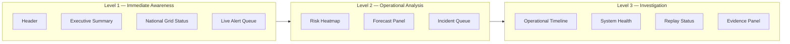

# dashboard_zoning.md

**Project:** SHAKTI Runtime Integration and Operational Command Center
**Owner:** Pratik Bhuwad
**Module:** Dashboard Zoning
**Version:** 2.0
**Last Updated:** 2025

---

## 1. Purpose

This document defines the physical layout, grid positioning, and information priority of every zone in the SHAKTI Operational Command Center dashboard.

Dashboard zoning establishes how operational information is organized on screen, ensuring that users achieve situational awareness with minimal cognitive effort and minimal scrolling. The strategy follows an **importance-first** approach: the most operationally critical information occupies the highest visual position and the largest screen real estate.

---

## 2. Design Goals

| Goal | Implementation |
|---|---|
| Critical information visible within 5 seconds | Executive Summary and Grid Status are in Row 1 and Row 2 |
| Minimize scrolling | All Level 1 zones fit within a 1440×900 viewport |
| Group related information | Operational analysis zones are co-located in Rows 3–4 |
| Consistent spacing | `gap-2.5` (10px) uniform grid gap throughout |
| Responsive across breakpoints | 12-column grid collapses gracefully to tablet and mobile |

---

## 3. Dashboard Grid Structure

The dashboard uses a **12-column CSS Grid** rendered inside `src/pages/Dashboard.tsx`.

```
┌──────────────────────────────────────────────────────────────────────┐
│                            HEADER                                    │
│  SHAKTI  |  Operational Command Center  |  LIVE  |  Time  |  User   │
└──────────────────────────────────────────────────────────────────────┘

┌──────────┬──────────┬──────────┬──────────┐  ← Executive Metrics (4×)
│ Metric 1 │ Metric 2 │ Metric 3 │ Metric 4 │
├──────────┼──────────┼──────────┼──────────┤  ← KPI Cards (4×)
│  KPI 1   │  KPI 2   │  KPI 3   │  KPI 4   │
└──────────┴──────────┴──────────┴──────────┘

┌──────────────────────────────┬─────────────────────┐
│   National Grid Status       │   Live Alert Queue  │
│   (col-span 7)               │   (col-span 5)      │
└──────────────────────────────┴─────────────────────┘

┌───────────────┬──────────────────────────────────────┐
│ Risk Heatmap  │        Forecast Panel                │
│ (col-span 4)  │        (col-span 8)                  │
└───────────────┴──────────────────────────────────────┘

┌──────────────────────────────┬───────────────────────┐
│   Incident Queue             │  Operational Timeline │
│   (col-span 6)               │  (col-span 6)         │
└──────────────────────────────┴───────────────────────┘

┌──────────────────────────────┬───────────────────────┐
│   System Health              │   Replay Status       │
│   (col-span 7)               │   (col-span 5)        │
└──────────────────────────────┴───────────────────────┘

┌──────────────────────────────────────────────────────┐
│                   Evidence Panel                     │
│                   (col-span 12)                      │
└──────────────────────────────────────────────────────┘
```

---

## 4. Zone Specifications

### Zone 1 — Header

| Property | Value |
|---|---|
| Component | `src/components/layout/Header.tsx` |
| Position | Fixed top bar, outside grid |
| Priority | Highest |
| Content | Branding, live clock, LIVE indicator, notifications, user identity |
| Refetch | Live clock via `setInterval` (1s) |

---

### Zone 2 — Executive Summary

| Property | Value |
|---|---|
| Component | `src/components/dashboard/ExecutiveSummary.tsx` |
| Grid Position | `col-span-12` |
| Priority | Highest |
| Row | 1 |
| Content | 4 Executive Metric Cards + 4 KPI Cards |
| API | `/api/executive-metrics`, `/api/kpis` |
| Refetch Interval | 30s |

Metrics displayed: Active Incidents, Grid Availability, Critical Alerts, System Health Score.
KPIs displayed: Total Load (GW), Renewable Mix (%), Grid Frequency (Hz), Transmission Loss (%).

---

### Zone 3 — National Grid Status

| Property | Value |
|---|---|
| Component | `src/components/dashboard/NationalGridStatus.tsx` |
| Grid Position | `col-span-12 lg:col-span-7` |
| Priority | High |
| Row | 2 |
| Content | Regional load bars, frequency, overall status, per-region status indicators |
| API | `/api/grid-status` |
| Refetch Interval | 30s |

Displays 5 regions: North, South, East, West, Central — each with load percentage bar, status dot, and operational status label.

---

### Zone 4 — Live Alert Queue

| Property | Value |
|---|---|
| Component | `src/components/dashboard/LiveAlertQueue.tsx` |
| Grid Position | `col-span-12 lg:col-span-5` |
| Priority | High |
| Row | 2 |
| Content | Severity-coded alert cards, unacknowledged badge count, acknowledged dimming |
| API | `/api/alerts` |
| Refetch Interval | 15s |

Severity levels: `critical` (red), `high` (orange), `medium` (yellow), `low` (blue), `info` (slate).

---

### Zone 5 — Risk Heatmap

| Property | Value |
|---|---|
| Component | `src/components/dashboard/RiskHeatmap.tsx` |
| Grid Position | `col-span-12 md:col-span-6 lg:col-span-4` |
| Priority | High |
| Row | 3 |
| Content | Per-region risk score bars sorted by score descending, risk factors |
| API | `/api/risk-scores` |
| Refetch Interval | 30s |

Risk levels map to the same `Severity` type: `critical`, `high`, `medium`, `low`.

---

### Zone 6 — Forecast Panel

| Property | Value |
|---|---|
| Component | `src/components/dashboard/ForecastPanel.tsx` |
| Grid Position | `col-span-12 md:col-span-6 lg:col-span-8` |
| Priority | Medium |
| Row | 3 |
| Content | 24h demand and renewable area chart, peak demand, peak time, confidence score |
| API | `/api/forecast` |
| Refetch Interval | 60s |
| Bundle | Lazy-loaded via `React.lazy()` to isolate Recharts from main bundle |

---

### Zone 7 — Incident Queue

| Property | Value |
|---|---|
| Component | `src/components/dashboard/IncidentQueue.tsx` |
| Grid Position | `col-span-12 md:col-span-6` |
| Priority | Medium |
| Row | 4 |
| Content | Active incidents with severity border, status, location, assigned operator |
| API | `/api/incidents` |
| Refetch Interval | 30s |

Incident statuses: `open` (red), `investigating` (yellow), `resolved` (green), `closed` (slate).

---

### Zone 8 — Operational Timeline

| Property | Value |
|---|---|
| Component | `src/components/dashboard/OperationalTimeline.tsx` |
| Grid Position | `col-span-12 md:col-span-6` |
| Priority | Medium |
| Row | 4 |
| Content | Chronological event feed with category icons (system, operator, alert, incident) |
| API | `/api/timeline` |
| Refetch Interval | 15s |

---

### Zone 9 — System Health

| Property | Value |
|---|---|
| Component | `src/components/dashboard/SystemHealth.tsx` |
| Grid Position | `col-span-12 md:col-span-7` |
| Priority | Medium |
| Row | 5 |
| Content | Per-service latency, uptime, status; overall health score bar |
| API | `/api/system-health` |
| Refetch Interval | 20s |

Services monitored: SCADA Gateway, EMS Core, DERMS API, Forecast Engine, OMS Service, PMU Collector.

---

### Zone 10 — Replay Status

| Property | Value |
|---|---|
| Component | `src/components/dashboard/ReplayStatus.tsx` |
| Grid Position | `col-span-12 md:col-span-5` |
| Priority | Low |
| Row | 5 |
| Content | Replay job progress bars, event counts, state indicators, duration |
| API | `/api/replay` |
| Refetch Interval | 10s |

Replay states: `idle`, `running`, `paused`, `completed`, `failed`.

---

### Zone 11 — Evidence Panel

| Property | Value |
|---|---|
| Component | `src/components/dashboard/EvidencePanel.tsx` |
| Grid Position | `col-span-12` |
| Priority | Low |
| Row | 6 |
| Content | Evidence records with source, confidence bar, description, related incident ID |
| API | `/api/evidence` |
| Refetch Interval | 60s |

Evidence types: `sensor`, `log`, `operator`, `model`, `external`.

---

## 5. Visual Priority Map



---

## 6. User Scan Flow

The dashboard is designed for an **F-pattern scan** common in operational interfaces:

1. **Top bar** — User confirms system identity and live status.
2. **Executive row** — User reads 4 metrics and 4 KPIs for immediate system state.
3. **Grid + Alerts row** — User checks regional health and scans unacknowledged alerts.
4. **Risk + Forecast row** — User assesses risk distribution and demand trajectory.
5. **Incidents + Timeline row** — User reviews active incidents and recent events.
6. **Health + Replay row** — User checks service availability and replay jobs.
7. **Evidence row** — User reviews supporting evidence for open incidents.

---

## 7. Responsive Behavior

| Breakpoint | Columns | Behavior |
|---|---|---|
| Desktop `≥1024px` | 12 | Full two-column operational layout as designed |
| Tablet `768–1023px` | 12 | Zones collapse to `col-span-6` or `col-span-12` pairs |
| Mobile `<768px` | 12 | All zones stack to `col-span-12` (single column) |

Tailwind responsive prefixes used: `md:` (768px), `lg:` (1024px).

---

## 8. Layout Rules

- All zones use `bg-slate-800/60 border border-slate-700/50 rounded-lg p-3` as the base card style.
- Zone headers use `text-xs font-semibold text-slate-300 uppercase tracking-wide`.
- Scrollable content areas use `overflow-y-auto max-h-64` to prevent zone overflow.
- The grid gap is `gap-2.5` (10px) — compact enough for information density, spacious enough for visual separation.
- No zone uses a fixed pixel height — all zones size to their content.
